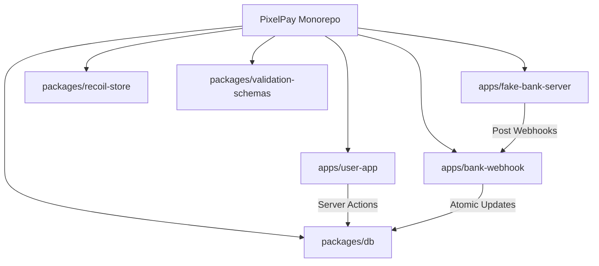

# 💎 PixelPay: High-Performance Digital Wallet Monorepo

[](https://turbo.build/)
[](https://www.typescriptlang.org/)
[](https://nextjs.org/)
[](https://www.prisma.io/)

PixelPay is a state-of-the-art digital wallet ecosystem designed for speed, security, and a premium user experience. Built as a monorepo, it integrates frontend services, banking webhooks, and simulation servers into a unified, scalable architecture.

---

## 🏗️ Architecture

The project uses a modern monorepo structure powered by **Turbo** and **PNPM**, ensuring blazing-fast builds and shared logic across all services.

### Core Ecosystem
- **[`user-app`](./apps/user-app)**: High-performance Next.js 14 application featuring glassmorphic UI and server-side transaction logic.
- **[`bank-webhook`](./apps/bank-webhook)**: Express server handling asynchronous payment confirmations from banking providers.
- **[`fake-bank-server`](./apps/fake-bank-server)**: A simulation environment to test end-to-end financial flows without real-world banking overhead.

### Shared Infrastructure
- **[`db`](./packages/db)**: Centralized Prisma schema and client management.
- **[`recoil-store`](./packages/recoil-store)**: Unified global state management for the client.
- **[`validation-schemas`](./packages/validation-schemas)**: Zod-powered schemas shared between client and server for type-safe data handling.



---

## ✨ Key Features

- **🛡️ Secure Transfers**: P2P transfers utilizing PostgreSQL row-level locking (`FOR UPDATE`) to prevent double-spending and ensure data integrity.
- **💸 Automated On-Ramping**: A simulated banking flow that demonstrates the lifecycle of a deposit, from initiation to webhook confirmation.
- **🎨 Premium UI**: A sleek, modern dashboard built with Tailwind CSS, featuring glassmorphism and smooth animations.
- **🔄 Robust Transaction Logic**: Automatic retries with exponential backoff for handling database serialization errors.
- **📊 Real-time Stats**: Instant updates on available and locked balances.

---

## 🛠️ Getting Started

### Prerequisites
- Node.js (>= 18)
- PNPM (>= 9)
- PostgreSQL

### Installation
1. Clone the repository:
   ```bash
   git clone https://github.com/harshxengr/PixelPay.git
   cd PixelPay
   ```
2. Install dependencies:
   ```bash
   pnpm install
   ```
3. Set up environment variables:
   - Copy `.env.example` to `.env` in the root and in each app folder.
   - Configure your `DATABASE_URL`.

### Development
Start the entire ecosystem in development mode:
```bash
pnpm run dev
```

---

## 📂 Project Structure

| Path | Description |
| :--- | :--- |
| `apps/user-app` | The main Next.js web application. |
| `apps/bank-webhook` | Webhook handler for bank notifications. |
| `apps/fake-bank-server` | Simulated bank API for testing. |
| `packages/db` | Database schema and Prisma client. |
| `packages/recoil-store` | Recoil state atoms and selectors. |
| `packages/validation-schemas` | Shared Zod schemas. |

---

## 🧪 Tech Stack Highlights

- **Frontend**: Next.js 14 (App Router), Tailwind CSS, Lucide Icons.
- **State Management**: Recoil.
- **Backend / ORM**: Node.js, Express, Prisma.
- **Validation**: Zod.
- **Tooling**: Turbo, PNPM, TypeScript.

---

## 📜 License
This project is licensed under the MIT License.
